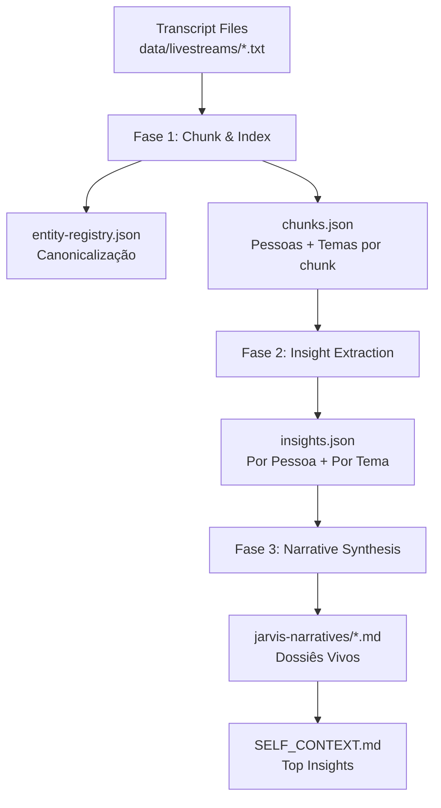

# Sessão Master: 5051a7b9-28b1-497a-a078-7bb43af8e858


## 📝 Artefato: implementation_plan.md

# KAIROS Jarvis Pipeline — Plano de Implementação

## Contexto e Objetivo

A live de 6 horas do Thiago Finch revelou o **Projeto Híbrido Jarvis**: um pipeline de 3 camadas que transforma dados brutos (calls, WhatsApp, Slack, aulas) em **narrativas estratégicas pesquisáveis** agrupadas por Pessoa e por Tema.

O KAIROS já possui subsistemas poderosos (Noesis Pipeline, Cognitive State Engine, RAG com 29K+ chunks), mas **não tem**:
- Chunking semântico de transcrições
- Entity Resolution (canonicalização de nomes)
- Extração de insights por pessoa/tema com prioridade
- Síntese narrativa incremental (dossiês vivos)

**Objetivo:** Construir o motor equivalente (ou superior) ao MegaBrain dentro do KAIROS, em Node.js puro, consumindo a API do Groq para inferência LLM.

---

## Proposed Changes

### 1. Jarvis Pipeline Engine (Motor Principal)

#### [NEW] [jarvis-pipeline.js](file:///c:/Users/Gabriel/Documents/My%20KAIROS/scripts/data-ingestion/jarvis-pipeline.js)

Motor que executa as 3 fases em sequência sobre qualquer arquivo de transcrição:

**Fase 1 — Chunk & Index (Prompt 1.1)**
- Corta o texto em chunks de ~500 palavras com overlap de 50 palavras
- Para cada chunk, usa o LLM para extrair: `pessoas[]`, `temas[]`, `resumo`
- Aplica Entity Resolution contra o `entity-registry.json`
- Salva os chunks indexados em `data/jarvis-index/chunks.json`

**Fase 2 — Insight Extraction (Prompt 2.1)**
- Agrupa chunks por pessoa e por tema
- Para cada agrupamento, gera insights com `priority: high|medium|low`
- Salva em `data/jarvis-index/insights.json`

**Fase 3 — Strategic Narrative Synthesis (Prompt 3.1)**
- Para cada pessoa/tema com insights `high`, gera uma narrativa fluida
- Modo incremental: se já existe narrativa anterior, **adiciona** sem reescrever
- Salva em `data/jarvis-narratives/{entity-name}.md`

---

### 2. Entity Registry (Canonicalização)

#### [NEW] [entity-registry.json](file:///c:/Users/Gabriel/Documents/My%20KAIROS/data/entity-registry.json)

```json
{
  "version": "1.0.0",
  "persons": {
    "thiago-finch": {
      "canonical": "Thiago Finch",
      "aliases": ["Finch", "Tiago", "Fincha"],
      "role": "CEO / Apresentador",
      "source": "live-megabrain-2026-02-27"
    }
  },
  "organizations": {
    "experia": {
      "canonical": "Experia Solutions",
      "aliases": ["ExperIA", "Experia"]
    }
  },
  "themes": {
    "reducao-custos": {
      "canonical": "Redução de Custos",
      "aliases": ["corte de gastos", "diminuir custos"]
    }
  }
}
```

O LLM recebe este registro como contexto no Prompt 1.1 e unifica menções automaticamente.

---

### 3. Integração com KAIROS Context

#### [MODIFY] [generate-context.js](file:///c:/Users/Gabriel/Documents/My%20KAIROS/scripts/evolution/generate-context.js)

- Atualizar `generateAutonomousMemory()` para também ler `data/jarvis-index/insights.json` e listar os top insights recentes no `SELF_CONTEXT.md`

---

## Arquitetura do Pipeline



---

## Verification Plan

### Automated Tests
1. Rodar `node scripts/data-ingestion/jarvis-pipeline.js` contra `transcript_full.txt`
2. Verificar que `chunks.json` contém >50 chunks com pessoas e temas extraídos
3. Verificar que `insights.json` contém insights categorizados por prioridade
4. Verificar que pelo menos 3 arquivos `.md` foram gerados em `jarvis-narratives/`
5. Rodar `node scripts/evolution/generate-context.js` e confirmar que os insights aparecem no `SELF_CONTEXT.md`

### Manual Verification
- Gabriel revisa as narrativas geradas para confirmar fidelidade ao conteúdo original


---

## 📝 Artefato: task.md

# Evolution API Setup + RP Gaps

## RP Gaps Resolved
- [x] LP + Quiz deployed on Vercel (confirmed by Gabriel)
- [x] RP Audit completed — 6 critical gaps identified

## Evolution API Setup
- [ ] Clone Evolution API repo
- [ ] Install dependencies + configure .env
- [ ] Create `whatsapp-bridge.js` (wire to KAIROS)

## Quick Fixes
- [ ] Fix `enterprise.json` alignment with Persona Engine
- [ ] Fix Night Shift scheduler paths

## MegaBrain Delta Integration (KAIROS V7 -> V8)
### Pilar 1: O Conclave (Multi-Agent Council)
- [x] Injetar mentalidade "Conclave" no Clone do Finch
- [x] Adicionar diretriz de "Conclave Validation" no `EXPERIA-MASTER.md`
- [x] Desenvolver logic gateway onde master-agent invoca conselho antes de outputs táticos.

### Pilar 2: Memory Index & Pipeline Autônomo
- [x] Construir Extrator de Lives Autônomo (yt-dlp + whisper)
- [x] Atualizar KAIROS Context Manager para reconhecer logs de chamadas diretamente de `data/transcripts/`.
- [x] Configurar Canonicalização de Tópicos (tagging nas extrações).

### Pilar 3: Modo Investigativo (Anti-Viés)
- [x] Reprogramar DNA do Clone-Finch para auditar mercado antes de gerar prompts.
- [x] Atualizar `cognitive-state-engine.js` para penalizar "Assunções Diretas" sem investigação de mercado preliminar.
- [x] Declarar Vitória RP Delta `v1.0-HARVEST`.

### Pilar 4: Projeto Híbrido Jarvis (Arquitetura Visual)
- [x] Receber descrições dos organogramas capturados por Gabriel.
- [x] Analisar as estruturas visuais apresentadas por Thiago Finch (Pipeline de 3 Prompts revelado).
- [x] Mapear deltas arquiteturais entre o Jarvis do MegaBrain e a ingestão do KAIROS.
- [x] Criar RP correspondente: `RP-20260227-MEGABRAIN-JARVIS-PIPELINE-v1.0-HARVEST.md`.

### Pilar 6: Internalização do Jarvis Engine (Novo)
- [x] Construir motor `jarvis-pipeline.js` (3 camadas de Prompt: Index, Insight, Narrative).
- [x] Desenvolver `entity-registry.json` para Canonicalização de nomes.
- [x] Integrar com o atual `transcript_full.txt` da live.

### Pilar 5: MegaBrain Repository Analysis (Em Andamento)
- [x] Encontrar e clonar repositório `thiagofinch/mega-brain`
- [x] Analisar a arquitetura oficial do código do MegaBrain
- [x] Mapear as diferenças entre o KAIROS e a implementação do MegaBrain 
- [x] Incorporar as melhores práticas tecnológicas (C-Level, Sales agents) ao KAIROS

### Pilar 7: Caixa Rápido & MVP de Caça (Novo)
- [x] Estruturação da operação emergencial (Tigrinho).
- [x] Empacotamento de pacote padronizado MVP (R$297 - 15 posts + bot + relatório).
- [x] Criação de ativos de demonstração (bot duplo: cliente/dono no Telegram, arte promocional).
- [x] Elaboração de template de Contrato de Permuta impresso/digital.
- [x] Deploy via arquitetura Zero Expense (Render.com) via repositório auxiliar (`petshop-demo`).
- [x] Configuração do sistema de Anti-Sleep / Auto-Ping (Github Actions rodando).

### Pilar 8: Execução Venda MVP (Cunhado)
- [x] Coletar informações do negócio do cunhado (Nicho, Produtos, Tom de voz) — *Já existe: RH Master Pumps*
- [x] Desenvolver Bot customizado com foco em conversão e suporte — *Atualizado para Arquitetura V3 (Express + Groq)*
- [x] Configurar repositório e infraestrutura (Render)
- [x] Entregar versão funcional operante

### Pilar 9: Amostra Grátis (Irmã) — Adaptive Assistant
- [x] Criar assistente "Blank Canvas" (sem persona rígida)
- [x] Implementar memória persistente de customização de persona via chat
- [x] Extrair para repositório isolado e preparar para deploy Render


---

## 📝 Artefato: walkthrough.md

# Walkthrough: KAIROS Jarvis Pipeline v1.0

## O que foi construído

Internalizamos a arquitetura do **Projeto Híbrido Jarvis** (revelada na live de 6h do Thiago Finch) como um motor nativo do KAIROS. O pipeline processa transcrições brutas em 3 camadas sequenciais de LLM.

## Artefatos Criados

| Arquivo                                                                                                        | Propósito                                  |
| -------------------------------------------------------------------------------------------------------------- | ------------------------------------------ |
| [jarvis-pipeline.js](file:///c:/Users/Gabriel/Documents/My%20KAIROS/scripts/data-ingestion/jarvis-pipeline.js) | Motor principal — 380+ linhas, 3 fases     |
| [entity-registry.json](file:///c:/Users/Gabriel/Documents/My%20KAIROS/data/entity-registry.json)               | Registro canônico de entidades             |
| [chunks.json](file:///c:/Users/Gabriel/Documents/My%20KAIROS/data/jarvis-index/chunks.json)                    | 41 chunks indexados com pessoas/temas      |
| [insights.json](file:///c:/Users/Gabriel/Documents/My%20KAIROS/data/jarvis-index/insights.json)                | 31 insights por pessoa/tema                |
| [jarvis-narratives/](file:///c:/Users/Gabriel/Documents/My%20KAIROS/data/jarvis-narratives)                    | 8 dossiês narrativos (3 pessoas + 5 temas) |

## Resultados da Execução

```
Pipeline completo em 294s (Fase 1) + 35s (Fase 3 recovery)

Fase 1 — Chunk & Index:  41/41 chunks ✅
Fase 2 — Insights:       31 insights extraídos (3 persons, 5 themes)
Fase 3 — Narrativas:     8/8 dossiês ✅
```

### Dossiês Gerados

**Pessoas:**
- [thiago-finch.md](file:///c:/Users/Gabriel/Documents/My%20KAIROS/data/jarvis-narratives/thiago-finch.md) — Estratégia de expansão, MegaBrain, obsessão empreendedora
- [alan.md](file:///c:/Users/Gabriel/Documents/My%20KAIROS/data/jarvis-narratives/alan.md) — Colaborador KAIROS
- [pedro.md](file:///c:/Users/Gabriel/Documents/My%20KAIROS/data/jarvis-narratives/pedro.md) — Colaborador KAIROS

**Temas:**
- [tema-megabrain-jarvis.md](file:///c:/Users/Gabriel/Documents/My%20KAIROS/data/jarvis-narratives/tema-megabrain-jarvis.md) — Arquitetura completa do Jarvis
- [tema-conclave-multi-agent-council.md](file:///c:/Users/Gabriel/Documents/My%20KAIROS/data/jarvis-narratives/tema-conclave-multi-agent-council.md) — Sistema de conselho multi-agente
- [tema-cloud-code.md](file:///c:/Users/Gabriel/Documents/My%20KAIROS/data/jarvis-narratives/tema-cloud-code.md) — Cloud Code e os 4 níveis de IA
- [tema-outsourcing.md](file:///c:/Users/Gabriel/Documents/My%20KAIROS/data/jarvis-narratives/tema-outsourcing.md) — Terceirização e reestruturação
- [tema-redu-o-de-custos.md](file:///c:/Users/Gabriel/Documents/My%20KAIROS/data/jarvis-narratives/tema-redu-o-de-custos.md) — Redução de custos operacionais

## Como re-executar

```bash
# Pipeline completo
node scripts/data-ingestion/jarvis-pipeline.js

# Apenas uma fase específica
node scripts/data-ingestion/jarvis-pipeline.js --phase 2

# Com input customizado
node scripts/data-ingestion/jarvis-pipeline.js --input data/livestreams/outra.txt
```


---
