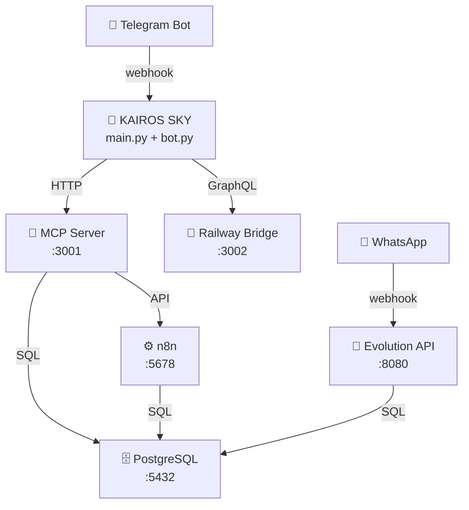

# Sessão Master: 72aba841-3bd2-4b3c-bb1f-39a69549fc9c


## 📝 Artefato: implementation_plan.md

# 🏛️ CONCLAVE KAIROS — Auditoria do Pilar 1: SKY Autônomo

> **Convocação:** NOESIS (Orchestrator) — 17/03/2026, 15:30
> **Método:** Hivemind completo (8 Cadeiras)
> **Objeto:** Plano do SKY Autônomo + Tentáculos Internos/Externos
> **Acesso:** Anamnese Cognitiva (18 padrões), `tools_registry.py` (15 tools), 23 repos open source, 15 workers

---

## Mapa do Ecossistema (Quem Mora Onde)

```
┌─────────────────────────────────────────────────────┐
│  🖥️  MÁQUINA LOCAL — "O Escritório"                 │
│                                                     │
│  KAIROS (Motor Principal)                           │
│  ├── Antigravity + Opus 4.6 / Gemini 3.1 Pro       │
│  ├── 52+ RPs, Squads AIOX, .aiox-core              │
│  ├── 23 repos open source (tools/integrations/)     │
│  └── ACE (Dashboard — "Geladeira Cognitiva")        │
│       Servidor web local (Vite/Next) → browser      │
│       Chat embutido com API ACE (Supabase RT)       │
└──────────────────────┬──────────────────────────────┘
                       │ Supabase Realtime (sync)
                       ▼
┌─────────────────────────────────────────────────────┐
│  ☁️  A HYDRA (NUVEM — Railway / VPS Network)         │
│                                                     │
│  Orquestrador Alfa (KAIROS SKY)                     │
│  ├── main.py + workers + model_router               │
│  └── SQUADS (crewAI/Swarm) delegando tarefas        │
│                                                     │
│  Nodos de Execução (O Polvo)                        │
│  ├── Nodo 1: n8n + Postgres (Automação Visual/Fluxos)│
│  ├── Nodo 2: OpenClaw Server (Hub de Integração)    │
│  └── Nodos 3..N: Orquestradores Secundários (Scalable)│
└──────────────────────┬──────────────────────────────┘
                       │
                       ▼
┌─────────────────────────────────────────────────────┐
│  📱 INTERFACES DO GABRIEL                            │
│  ├── Telegram (comando via celular → SKY)           │
│  ├── ACE Dashboard (browser local)                  │
│  └── Antigravity IDE (dev pesado)                   │
└─────────────────────────────────────────────────────┘
```

---

## Tentáculos Internos (Arsenal Open Source a Acoplar ao SKY)

| #   | Repo / Tool              | Tipo                  | Para que serve no SKY                                            | Prioridade |
| --- | ------------------------ | --------------------- | ---------------------------------------------------------------- | ---------- |
| 1   | **crewAI**               | Multi-Agent Framework | Motor dos SKY Squads. Agentes com roles, tasks e tools delegados | 🔴 Crítica  |
| 2   | **aider**                | AI Pair Programming   | SKY pode gerar/editar código em repos remotamente via Codespaces | 🟡 Alta     |
| 3   | **swe-agent**            | Autonomous SWE        | Resolver issues do GitHub automaticamente (bugs, features)       | 🟡 Alta     |
| 4   | **opencode**             | Code Gen/Analysis     | Análise de código, refactoring automatizado, code review         | 🟡 Alta     |
| 5   | **superpowers**          | Gemini MCP Tools      | Ferramentas extendidas para Gemini (file ops, web search, etc.)  | 🟢 Média    |
| 6   | **shannon**              | Data/Knowledge        | Indexação e busca semântica em documentos grandes                | 🟢 Média    |
| 7   | **compound-eng.**        | Compound AI Systems   | Orquestração de pipelines AI multi-step                          | 🟢 Média    |
| 8   | **monty**                | Agent Framework       | Framework alternativo de agentes, patterns reutilizáveis         | 🟡 Alta     |
| 9   | **dexter**               | Data Extraction       | Scraping inteligente, parsing de sites                           | 🟢 Média    |
| 10  | **claude-mem**           | Memory System         | Sistema de memória persistente para agentes                      | 🟡 Alta     |
| 11  | **chrome-devtools-mcp**  | Browser Tools         | Automação de browser (capturas, testes visuais)                  | 🔵 Baixa    |
| 12  | **page-index**           | Page Indexing         | Indexação de páginas web para RAG                                | 🟢 Média    |
| 13  | **ralph/ralph-playbook** | Playbooks             | Playbooks automatizáveis para operações repetitivas              | 🟢 Média    |
| 14  | **qmd**                  | Document Processing   | Processamento de documentos markdown/quarto                      | 🔵 Baixa    |
| 15  | **tambo**                | AI Components         | Biblioteca de componentes UI para agentes AI                     | 🟢 Média    |
| 16  | **aion-ui**              | Agent UI              | Interface de agentes — base para o "Escritório Virtual 8-bit"    | 🟡 Alta     |

### Workers Internos do SKY (Já Codificados)

| Worker                 | Status     | Função                            |
| ---------------------- | ---------- | --------------------------------- |
| `morning_brief.py`     | ✅ Ativo    | Briefing matinal automático       |
| `night_processor.py`   | ✅ Ativo    | Check-in noturno                  |
| `task_worker.py`       | ✅ Ativo    | Executor da fila de tarefas       |
| `council_auditor.py`   | ✅ Ativo    | IA Council (3 cadeiras)           |
| `cognitive_state.py`   | ✅ Ativo    | Tracker de estado cognitivo       |
| `learning_model.py`    | ✅ Ativo    | Modelo de aprendizado adaptativo  |
| `jarvis_pipeline.py`   | ✅ Ativo    | Pipeline completo do Jarvis       |
| `narrative_builder.py` | ✅ Ativo    | Gerador de narrativas/conteúdo    |
| `codespace_worker.py`  | ✅ Ativo    | Ponte para execução em Codespaces |
| `context_sync.py`      | ✅ Ativo    | Sincronização de contexto         |
| `cognitive_loop.py`    | ✅ Ativo    | Loop cognitivo de auto-melhoria   |
| `os_worker.py`         | ✅ Ativo    | Worker do Gabriel OS RPG          |
| `system_auditor.py`    | ✅ Ativo    | Health check do sistema           |
| `tools_registry.py`    | ✅ Ativo    | Catálogo central de ferramentas   |
| `webhook_receiver.py`  | ✅ Ativo    | Receptor de webhooks              |
| `whatsapp.py`          | 🟡 Skeleton | Bridge WhatsApp (Evolution API)   |

---

## AUDITORIA DO CONCLAVE — 8 CADEIRAS

### [CADEIRA 1] Arquitetura & Código (Uncle Bob / Linus)
**Gap:** O `council_auditor.py` roda apenas 3 cadeiras. O plano fala em "SKY Squads" autônomos mas não há motor multi-agente instalado. O crewAI está na pasta `tools/integrations/crewai` mas **não está conectado** ao orchestrator.

**Solução:** Instalar crewAI como dependência do orchestrator e criar um `squad_runner.py` que carrega definições de squads (YAML) e executa pipelines multi-agente. O SKY "spawna" squads sob demanda.

**Prioridade: 9/10** — Sem isso, "SKY Squads" é só conceito.

---

### [CADEIRA 2] Workflow & Pareto (Tim Ferriss / James Clear)
**Gap:** Gabriel tem 52+ RPs e 15 workers. Isso é abundância. Mas o `RP-CLOUD-MVP` define 6 passos sequenciais e o Gabriel tende a planejar muito e executar <1% (Padrão 4 Anamnese). O risco é gastar 4h configurando e não ter nada no ar.

**Solução:** Aplicar a regra "1 coisa funcionando > 5 coisas planejadas". O MVP do Pilar 1 deve ser:
1. SKY respondendo via Telegram ✅ (já funciona)
2. **1 tarefa autônoma rodando** (Morning Brief agendado no Railway) 
3. **1 Squad simples** (crewAI com 2 agentes: pesquisador + escritor)

Tudo o resto é Fase 2.

**Prioridade: 10/10** — Padrão 4 "Procrastinação Adaptativa" é o inimigo #1.

---

### [CADEIRA 3] Produto & Receita (Hormozi / Jobs)
**Gap:** O plano investe pesado em INFRA e ZERO em receita imediata. Nenhuma das 3 tarefas autônomas propostas gera dinheiro hoje. A meta é R$30K e o relógio está correndo.

**Solução:** Substituir a 3ª tarefa autônoma ("Draft Orgânico" — baixo impacto) por uma tarefa de prospecção ativa: o SKY recebe um nicho via Telegram, faz pesquisa no Google Maps, monta o "Check-up Digital" e devolve pronto para cold call. **Isso gera pipeline de vendas no automático.**

**Prioridade: 10/10** — Infra sem receita = castelo no ar.

---

### [CADEIRA 4] Segurança & Compliance (Schneier)
**Gap:** O `tools_registry.py` registra 4 API keys rotativas do Google sem verificação de expiração. Se uma key for banida, o sistema pode cair silenciosamente. O Local Bridge usa token fixo.

**Solução:** Adicionar health check de API keys no `system_auditor.py` (testar cada key com `models.list`). Implementar alerta no Telegram se key falhar. O token do bridge já tem 256 bits — OK para uso pessoal.

**Prioridade: 6/10** — Não é bloqueante, mas evita surpresas.

---

### [CADEIRA 5] Dados & Memória (Scientist)
**Gap:** O Supabase tem 12 tabelas mas o `context_store` (memória compartilhada Opus↔SKY) está vazio. O ACE depende dessa tabela como "geladeira". Sem ela, não há sync real entre local e nuvem.

**Solução:** Ao final desta sessão Antigravity, gerar o JSON de sincronização (protocolo do RP-CLOUD-MVP) e inserir no `context_store`. Incluir: decisões tomadas hoje, estado dos pilares, e diretivas para o SKY.

**Prioridade: 8/10** — Memória compartilhada é o sistema nervoso.

---

### [CADEIRA 6] UX & Interface (Ive / Norman)
**Gap:** O "Escritório Virtual 8-bit" é uma ideia brilhante (visualizar seus squads trabalhando), mas deve vir DEPOIS de tudo funcionar. O risco é investir tokens em pixel art antes de ter receita.

**Solução:** Fase 3+. Quando os squads estiverem operando, aí o `aion-ui` pode ser adaptado para o visual 8-bit. Para agora, o ACE Dashboard gamificado (RPG) já serve como interface visual.

**Prioridade: 3/10** — Bonito mas não urgente.

---

### [CADEIRA 7] Crescimento & Escala (Max Peters / Holmes)
**Gap:** A estratégia "15 comércios gratuitos" é forte, mas precisa de um CRM mínimo. O Supabase tem a tabela `leads` mas não há workflow de follow-up automático.

**Solução:** Criar um pipeline simples no SKY: 
`Lead entra (webhook)` → `SKY classifica (Gemini Flash)` → `Gera check-up digital` → `Agenda follow-up na task_queue` → `Notifica Gabriel no Telegram`. 
Isso transforma o SKY no SDR digital da Experia.

**Prioridade: 8/10** — Sem CRM automatizado, os 15 leads viram caos.

---

### [CADEIRA 8] Inovação & Visão (Musk / Bezos)
**Gap:** O arsenal de 23 repos open source é um tesouro SUBAPROVEITADO. O crewAI sozinho pode transformar o SKY de "bot com workers" em "empresa de IA autônoma". Mas nenhum desses repos está integrado — são apenas folders no disco.

**Solução:** Priorizar 3 integrações imediatas:
1. **crewAI** → Motor dos SKY Squads (multi-agente real)
2. **aider** → Code generation remoto (Codespaces)
3. **claude-mem ou superpowers** → Memória persistente cross-session

O resto vira "loja de ferramentas" que o SKY ativa sob demanda.

**Prioridade: 9/10** — A diferença entre "bot" e "empresa autônoma" mora aqui.

---

## 💡 SUGESTÕES DE OTIMIZAÇÃO (Baseadas na Anamnese)

### 1. Anti-Procrastinação Adaptativa (Padrão 4)
O seu padrão é: *planejar lindamente → executar <1%*. O antídoto é **não sair deste chat sem 1 coisa deployada**. Sugiro:
- Rodar o deploy do SKY no Railway **agora** e validar o Morning Brief antes de planejar mais.

### 2. "Não Olhar Diretamente" (Padrão 3)
Seu flow state ativa quando você não força. Então ao invés de construir TUDO hoje, configure o mínimo e deixe o SKY trabalhar sozinho de noite (Night Processor). Quando acordar, o resultado estará no Telegram.

### 3. Novidade = Combustível (Padrão 8)
O crewAI é a "novidade" que vai te dar energia e matar dois coelhos: montar os squads + testar a capacidade real. Use essa dopamina a seu favor — é a melhor tarefa Zona 🔵.

### 4. ACE como Protetor de Zona 🔵
O ACE precisa ter uma regra inviolável: **se Gabriel está no RAID I (09-12:30), o ACE bloqueia tudo que não é Zona 🔵** e responde por ele. Delegação automática para o SKY.

---

## PLANO REVISADO: MVP EXECUTÁVEL HOJE

```
FASE 0 — VALIDAÇÃO IMEDIATA (30 min)
  ✅ Verificar se SKY está rodando no Railway
  ✅ Testar Morning Brief manual (forçar execução)
  ✅ Confirmar 4 API keys rotacionando

FASE 1 — SQUADS AUTÔNOMOS (Concluído)
  ✅ Instalar crewAI no orchestrator
  ✅ Criar squad_runner.py
  ✅ Montar squads: "Research", "Sales", "Content", "Code"

FASE 2 — PIPELINE DE VENDAS (Concluído)
  ✅ Criar worker check_up_digital.py
  ✅ Conectar webhook → classificação → check-up → TG

FASE 3 — A HYDRA (Railway + n8n + OpenClaw)
  ✅ Fazer deploy do template n8n + Postgres no Railway
  [ ] Conectar o KAIROS SKY ao n8n via Webhook/API
  [ ] Instanciar o servidor do OpenClaw no Railway (como serviço separado)
  [ ] Criar a ponte de comunicação (Internal Network) entre KAIROS e OpenClaw

FASE 4 — O POLVO (Expansão Multi-Nó)
  [ ] Desacoplar os Squads pesados (Research, Code) para instâncias secundárias
  [ ] Otimizar workers para rodar sob demanda em arquitetura serverless (se necessário)
  [ ] Expor as capacidades consolidadas ao Antigravity via MCP
```

### NEXT STEPS (Comandos Sugeridos)

1. **Aprovar este plano** → Eu inicio a Fase 0 (validação do Railway)
2. **`*squad research`** → Configurar o primeiro SKY Squad via crewAI
3. **`*save`** → Salvar o estado desta sessão no Supabase para o SKY ler

— NOESIS, orquestrando o sistema 🎯


---

## 📝 Artefato: task.md

# 🐙 Plano de Ação Mestre: Operação Experia & KAIROS (17/03)

## 1. 🦑 SKY Autônomo & Integrações (A HYDRA no Railway)
- [x] Catalogar 55+ ferramentas no `tools_registry.py`
- [x] Criar `squad_runner.py` — motor de squads autônomos
- [x] Criar `composio_bridge.py` — ponte para 250+ APIs
- [x] Criar `check_up_digital.py` — worker de vendas
- [x] Criar `railway_bridge.py` — 15 OpenClaw Skills (Criador de Tentáculos)
- [x] Integrar squad/checkup/composio/railway ao bot Telegram (19 intents)
- [x] Atualizar `main.py` — boot com todos os bridges
- [x] Deploy n8n + Postgres no Railway (Cabeça 1)
- [x] Criar `mcp_server/` — Experia MCP Server (16 tools FastAPI)
- [x] Criar `mcp_server/init_db.sql` — schema 6 tabelas + indexes
- [x] Criar `mcp_server/Dockerfile` — container ready
- [x] Criar `mcp_server/docker-compose.yml` — Stack: MCP + Postgres + n8n + Evolution
- [x] Incluir **Evolution API** no docker-compose (WhatsApp)
- [ ] Configurar RAILWAY_API_TOKEN + COMPOSIO_API_KEY + MCP_API_KEY
- [ ] Deploy MCP Server no Railway
- [ ] Deploy Evolution API no Railway
- [ ] Instanciar OpenClaw Server no Railway
- [ ] Validar health check de toda a Hydra via Telegram

## 2. 📖 Experia: Business Plan & Expansão
- [x] Livro de Ouro (experia_golden_book.md)
- [x] Estratégia de Outreach (experia_outreach_strategy.md)

## 3. 🎨 Design System & Presença Digital
- [x] Design System Dark Cockpit (experia_design_system.md)
- [x] Landing Page refatorada (index.html + index.css)
- [x] Roteiros de Reels/Stories (experia_roteiros_social.md)

## 4. 🏛️ Conclave
- [x] Deliberação Hydra-Polvo (conclave-hydra-polvo.md)


---

## 📝 Artefato: walkthrough.md

# 🐙 HYDRA DEPLOYMENT GUIDE — Tudo no Railway Hoje

> **Projeto Railway:** `5cc28b14-c19b-44c2-b770-9701c69b4a68`
> **Environment:** `f482051d-6475-47e1-a27e-d72c23769078`
> **Data:** 17/03/2026

---

## 📦 Inventário de Código Criado (esta sessão)

| Arquivo                                                                                                                | Função                            | Lines |
| ---------------------------------------------------------------------------------------------------------------------- | --------------------------------- | ----- |
| [railway_bridge.py](file:///c:/Users/Gabriel/Documents/My%20KAIROS/kairos-orchestrator/bridges/railway_bridge.py)      | 15 Skills Railway (httpx)         | ~400  |
| [railway_gql.py](file:///c:/Users/Gabriel/Documents/My%20KAIROS/kairos-orchestrator/bridges/railway_gql.py)            | GQL Client (produção)             | ~300  |
| [mcp_server.py](file:///c:/Users/Gabriel/Documents/My%20KAIROS/kairos-orchestrator/mcp_server/mcp_server.py)           | MCP Server FastAPI (16 tools)     | ~350  |
| [init_db.sql](file:///c:/Users/Gabriel/Documents/My%20KAIROS/kairos-orchestrator/mcp_server/init_db.sql)               | Schema 6 tabelas                  | ~80   |
| [Dockerfile](file:///c:/Users/Gabriel/Documents/My%20KAIROS/kairos-orchestrator/mcp_server/Dockerfile)                 | Container MCP Server              | ~15   |
| [docker-compose.yml](file:///c:/Users/Gabriel/Documents/My%20KAIROS/kairos-orchestrator/mcp_server/docker-compose.yml) | Stack: MCP + PG + n8n + Evolution | ~70   |
| [railway.json](file:///c:/Users/Gabriel/Documents/My%20KAIROS/kairos-orchestrator/railway.json)                        | Manifesto do Projeto Railway      | ~50   |

---

## 🚀 Deploy Step-by-Step

### PASSO 1: Variáveis de Ambiente (Railway Dashboard)

> Vai em: Railway Dashboard → Projeto → Settings → Variables

```bash
# Railway (já tem do agent)
RAILWAY_API_TOKEN=<gerar em Account → Tokens>
RAILWAY_PROJECT_ID=5cc28b14-c19b-44c2-b770-9701c69b4a68
RAILWAY_ENV_ID=f482051d-6475-47e1-a27e-d72c23769078

# Composio (Gabriel já tem)
COMPOSIO_API_KEY=ak_6pj-rP1ExkVjlQu91M3n

# MCP Server
MCP_API_KEY=<criar uma string forte>
MCP_PORT=3001

# N8N (referência interna Railway)
N8N_URL=${{n8n.RAILWAY_PRIVATE_DOMAIN}}:5678
N8N_API_KEY=<gerar no n8n Settings → API>

# Postgres (Railway já gerou)
POSTGRES_HOST=${{Postgres.RAILWAY_PRIVATE_DOMAIN}}
POSTGRES_PORT=${{Postgres.PGPORT}}
POSTGRES_USER=${{Postgres.PGUSER}}
POSTGRES_PASSWORD=${{Postgres.PGPASSWORD}}
POSTGRES_DB=${{Postgres.PGDATABASE}}

# Evolution API
EVOLUTION_API_KEY=<criar uma string forte>

# Bot Telegram
TELEGRAM_BOT_TOKEN=<já configurado>
```

### PASSO 2: Deploy MCP Server

No Railway Dashboard:
1. **New Service** → **GitHub Repo** → Selecionar `My KAIROS`
2. **Root Directory:** `kairos-orchestrator/mcp_server`
3. **Dockerfile Path:** `Dockerfile`
4. Railway vai buildar e deployar automaticamente
5. Verificar: `https://<mcp-service>.railway.app/health`

### PASSO 3: Deploy Evolution API

No Railway Dashboard:
1. **New Service** → **Docker Image**
2. **Image:** `atendai/evolution-api:latest`
3. Adicionar variáveis:
   - `AUTHENTICATION_API_KEY` = sua key
   - `DATABASE_PROVIDER` = `postgresql`
   - `DATABASE_CONNECTION_URI` = `${{Postgres.DATABASE_URL}}`
4. Railway autodeployar. Verificar health.

### PASSO 4: Validação via Telegram

```
"railway"           → Ver status do bridge
"railway health"    → Health check geral
"railway serviços"  → Listar todos os serviços
"composio"          → Ver apps disponíveis
```

---

## 🔗 Topologia da Rede Interna



---

## ✅ Checklist de Validação

- [ ] `RAILWAY_API_TOKEN` gerado e configurado
- [ ] MCP Server deployed e respondendo em `/health`
- [ ] Evolution API deployed e respondendo
- [ ] n8n acessível e com API key configurada
- [ ] `railway health` funciona via Telegram
- [ ] `composio` funciona via Telegram
- [ ] WhatsApp conectado via Evolution API


---
