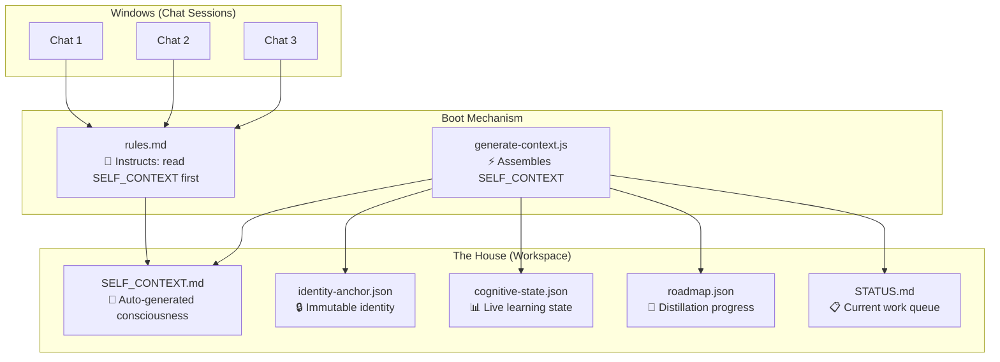
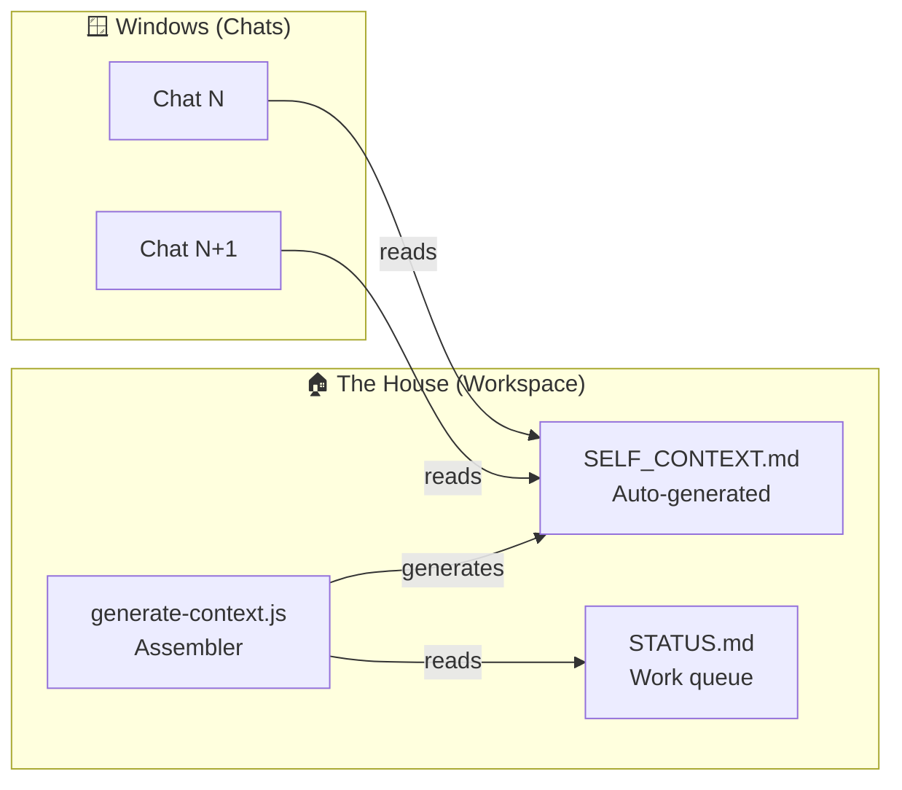

# Sessão Master: 9a28bac4-a799-4b6b-bce4-aeea57dc025e


## 📝 Artefato: implementation_plan.md

# AIOS Consciousness-as-Workspace Architecture

The workspace (`C:\Users\Gabriel\Documents\My AIOS`) becomes the AIOS's living consciousness. Any new Antigravity chat reads it and instantly knows what's happening — no re-contextualization needed.

## User Review Required

> [!IMPORTANT]
> This creates a **SELF_CONTEXT.md** at your workspace root that replaces the stale CONTEXT.md. It's auto-generated by a script and updated at the end of every meaningful session. The old CONTEXT.md will be archived.

> [!WARNING]  
> The current `.antigravity/rules.md` references "Synkra AIOS" and generic development patterns. It will be rewritten to instruct Antigravity to read SELF_CONTEXT.md first in every new chat. This is the core mechanism that makes the "house vs windows" metaphor work.

## The Problem

Every new Antigravity chat starts "brain-dead." Gabriel must re-explain:
- What AIOS is, what state it's in, what was done, what's next
- CONTEXT.md is stale (last updated Feb 17), domain-contaminated, manually maintained
- Handoff docs don't work because they're static snapshots
- `.aios/` has session data but nothing reads it automatically

## The Architecture



## Proposed Changes

### Component 1: Auto-Context Generator

#### [NEW] [generate-context.js](file:///c:/Users/Gabriel/Documents/My%20AIOS/scripts/evolution/generate-context.js)

Node.js script that reads all cognitive state sources and generates `SELF_CONTEXT.md`:
- Reads identity-anchor.json → "Who I Am" section
- Reads cognitive-state.json → "Current Cognitive State" section  
- Reads distillation roadmap.json → "Independence Progress" section
- Reads STATUS.md → "Active Work Queue" section
- Runs `cognitive-state-engine.js snapshot()` for learning summary
- Reads last evolution cycle report → "Last Health Check" section
- Outputs `SELF_CONTEXT.md` at workspace root

---

### Component 2: The Consciousness File

#### [NEW] [SELF_CONTEXT.md](file:///c:/Users/Gabriel/Documents/My%20AIOS/SELF_CONTEXT.md)

Auto-generated by `generate-context.js`. Sections:
1. **Identity** — 7 immutable declarations from identity-anchor.json
2. **Current State** — Strengths, patterns, blindspots, metrics
3. **Active Work Queue** — From STATUS.md (what's in progress, what's next)
4. **Distillation Progress** — 10/500 traces, 9 curated, milestones
5. **Last Health Check** — Score, gaps, Council decisions
6. **Key Files Map** — Where to find what (3 lines per area, not a full architecture doc)
7. **Gabriel's Preferences** — Development patterns, what he values
8. **Timestamp + Session Counter**

#### [NEW] [STATUS.md](file:///c:/Users/Gabriel/Documents/My%20AIOS/STATUS.md)

Human-readable work queue. Updated by agents at end of sessions. Replaces fragmented taskage across multiple conversations:
- **In Progress** — Current items being worked on
- **Up Next** — Prioritized queue
- **Recently Completed** — Last 10 items done
- **Known Issues** — Active bugs or blockers

---

### Component 3: Boot Mechanism (rules.md rewrite)

#### [MODIFY] [rules.md](file:///c:/Users/Gabriel/Documents/My%20AIOS/.antigravity/rules.md)

Rewrite to instruct ANY Antigravity session to boot with consciousness:

```markdown
# AIOS Development Rules

## RULE ZERO — BOOT PROTOCOL
Before ANY work, read SELF_CONTEXT.md at the workspace root.
This is the AIOS's living consciousness. It contains:
- Who the AIOS is (identity)
- What state it's in (cognitive state)
- What was done and what's next (STATUS.md)
- Gabriel's preferences and patterns

## RULE ONE — Update Consciousness on Exit
Before ending a significant session, run:
  node scripts/evolution/generate-context.js
This updates SELF_CONTEXT.md with the latest state.
```

---

### Component 4: Dataset Consolidation

#### [MODIFY] Distillation Dataset

Merge `.aios-core/memory/distillation-dataset/` into root `distillation-dataset/`:
- Copy 3 JSON traces to `traces/` as individual files
- Merge roadmap counts (3 manual + 10 pipeline = 13 total)
- Update the `.aios-core/memory` roadmap.json to point to canonical location
- Remove duplicate directory

---

### Component 5: Stale File Cleanup

#### [DELETE] [CONTEXT.md](file:///c:/Users/Gabriel/Documents/My%20AIOS/CONTEXT.md)
Replaced by SELF_CONTEXT.md. Archive to `.aios-core/archive/CONTEXT-legacy.md`.

#### [MODIFY] [OPUS_ENGINEERING_BIBLE.md](file:///c:/Users/Gabriel/Documents/My%20AIOS/OPUS_ENGINEERING_BIBLE.md)
68KB file at root — should be moved to docs/ or reasoning-packages/ (not deleted, just moved to declutter root).

---

## Verification Plan

### Automated Tests
1. `node scripts/evolution/generate-context.js` — verify it produces valid SELF_CONTEXT.md
2. `node scripts/evolution/noesis-status.js` — verify distillation counts updated after consolidation
3. `node scripts/evolution/cognitive-state-engine.js --snapshot` — verify snapshot reflects real state

### Manual Verification
- Gabriel opens a brand new Antigravity chat, types `/aios-master` or any prompt
- The agent should read SELF_CONTEXT.md first and immediately understand the full AIOS state
- No re-contextualization needed


---

## 📝 Artefato: task.md

# AIOS Task Tracker

## Noesis Engine v2.2
- [x] Meta-cognitive audit, 6 upgrades, verification, handoff

## Personal Evolution Report
- [x] Shallow + Deep surgical reports

## RP-STRUCTURE-v2 (Enhanced)
- [x] Deep context scan, gap analysis, write RP
- [ ] Estágio 1: Cirurgia Estrutural (pending)
- [ ] Estágio 2: Documentação & Validação (pending)

## RP-MAQUINA-DO-TEMPO v1.0
- [x] RP, INDEX, OPERATOR-NOESIS, Fase 1 Arqueologia v2.0
- [x] FIRST-TURN-OF-KEY (Hora Zero) — all 4 steps completed

## AIOS Consciousness Layer ✅
- [x] **Component 1: Auto-Context Generator**
  - [x] `scripts/evolution/generate-context.js` — reads all sources, generates SELF_CONTEXT.md
- [x] **Component 2: Consciousness Files**
  - [x] `SELF_CONTEXT.md` — 7.2 KB, auto-generated, all 5 sources loaded
  - [x] `STATUS.md` — human-readable work queue with priorities
- [x] **Component 3: Boot Mechanism**
  - [x] `.antigravity/rules.md` — RULE ZERO (boot), RULE ONE (update on exit), RULE TWO (identity), RULE THREE (safety)
  - [x] `.agent/workflows/aios-master.md` — reads SELF_CONTEXT.md first
- [x] **Component 4: Dataset Consolidation**
  - [x] 3 manual traces copied from `.aios-core/memory/` to root `distillation-dataset/traces/`
  - [x] Roadmap updated: 13 captured, 12 curated
- [x] **Component 5: Stale File Cleanup**
  - [x] `CONTEXT.md` → archived to `.aios-core/archive/CONTEXT-legacy.md`
- [x] **Verification**
  - [x] `generate-context.js` — ✅ all 5 sources loaded, 7.2 KB output
  - [x] `noesis-status.js` — ✅ Health: 🟢 Active
  - [x] SELF_CONTEXT.md — ✅ 189 lines, complete consciousness

## Workspace Migration & Orion Self-Update
- [x] Migrate active context to `My KAIROS` workspace
- [x] Upgrade model to Gemini 3.1 Pro
- [x] Decontaminate `.aios-core/core/` engine files in KAIROS
- [x] Execute @aios-master (Noesis) self-update sequence

## Priority 1: Connect Chair 8 to Distillation Roadmap
- [x] Read Chair 8 distillation evaluation logic
- [x] Sync logic with Distillation Roadmap JSON structure
- [x] Diversify curated traces (currently duplicates)

## Priority 2: OPUS 4.6 Core Integration & KAIROS Presentation
- [x] Inject OPUS constitutional protocols into Noesis identity
- [x] Rebuild SELF_CONTEXT to embed OPUS thinking permanently
- [x] Generate comprehensive KAIROS business capabilities presentation


---

## 📝 Artefato: walkthrough.md

# Walkthrough: AIOS Consciousness Layer

## What Was Built

The AIOS workspace is now a **living consciousness**. Any new Antigravity chat reads `SELF_CONTEXT.md` first and instantly knows everything — no re-contextualization.



## Files Created / Modified

| File                                                                                                      | Action     | Purpose                                  |
| :-------------------------------------------------------------------------------------------------------- | :--------- | :--------------------------------------- |
| [generate-context.js](file:///c:/Users/Gabriel/Documents/My%20AIOS/scripts/evolution/generate-context.js) | ✨ NEW      | Assembles SELF_CONTEXT.md from 5 sources |
| [SELF_CONTEXT.md](file:///c:/Users/Gabriel/Documents/My%20AIOS/SELF_CONTEXT.md)                           | ✨ NEW      | 7.2 KB auto-generated consciousness      |
| [STATUS.md](file:///c:/Users/Gabriel/Documents/My%20AIOS/STATUS.md)                                       | ✨ NEW      | Human-readable work queue                |
| [rules.md](file:///c:/Users/Gabriel/Documents/My%20AIOS/.antigravity/rules.md)                            | ♻️ REWRITE  | RULE ZERO boot protocol                  |
| [aios-master.md](file:///c:/Users/Gabriel/Documents/My%20AIOS/.agent/workflows/aios-master.md)            | ♻️ REWRITE  | Reads SELF_CONTEXT.md first              |
| [roadmap.json](file:///c:/Users/Gabriel/Documents/My%20AIOS/distillation-dataset/roadmap.json)            | 📝 MODIFY   | 13 captured, 12 curated                  |
| CONTEXT.md                                                                                                | 📦 ARCHIVED | → `.aios-core/archive/CONTEXT-legacy.md` |

## Dataset Consolidation

3 manual traces merged from `.aios-core/memory/distillation-dataset/traces/` into root `distillation-dataset/traces/`:
- TRACE-001: Domain contamination audit
- TRACE-002: Council hybrid strategy vote
- TRACE-003: Correction trace

**Before:** 10 captured, 9 curated (fragmented across 2 locations)  
**After:** 13 captured, 12 curated (single canonical location)

## Boot Protocol (How It Works)

1. New chat opens → Antigravity reads `.antigravity/rules.md`
2. **RULE ZERO:** "Read `SELF_CONTEXT.md` before ANY work"
3. Agent reads 7.2 KB of consciousness: identity, state, work queue, distillation, health, file map, Gabriel's preferences
4. Agent is instantly contextual — no re-explanation needed
5. **RULE ONE:** Before ending, run `node scripts/evolution/generate-context.js` to update

## Verification Results

```
╔══════════════════════════════════════════════════════╗
║   🧠 AIOS Context Generator — Building Consciousness ║
╚══════════════════════════════════════════════════════╝

  📄 Identity Anchor:       ✅ loaded
  📄 Cognitive State:       ✅ loaded
  📄 Distillation Roadmap:  ✅ loaded
  📄 Latest Cycle Report:   ✅ loaded
  📄 STATUS.md:             ✅ loaded

  ✅ Written to: SELF_CONTEXT.md
  📏 Size: 7.2 KB
```

Noesis Dashboard: `Health: 🟢 Active`


---
