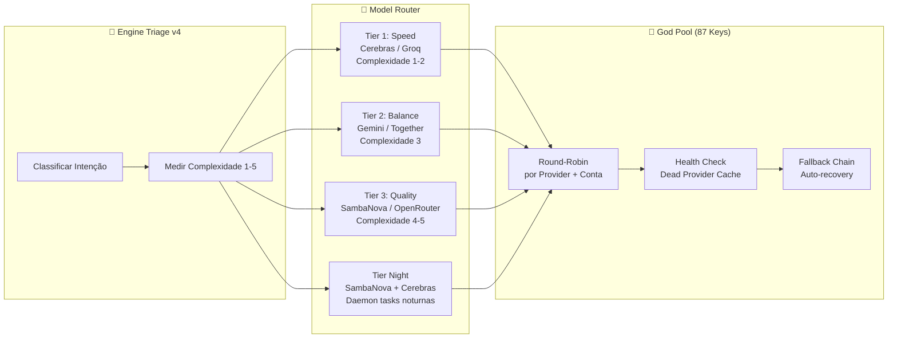

# Sessão Master: f91f376d-1dc0-4088-bb33-a6f0b872245e


## 📝 Artefato: implementation_plan.md

# Erradicação de Memory Gaps & MCP Stabilization

## Resumo
Este plano resolve (1) a amnésia entre sessões do Antigravity estruturando um protocolo rigoroso de convergência de Memória de Curto e Longo Prazo, e (2) corrige as constantes quedas ("context deadline exceeded") do ecossistema MCP.

## Proposed Changes

### [Core] Estratégia de Zero Memory Gap

Para garantir que o Antigravity (Cérebro) nunca perca o fio da meada, consolidaremos sua memória num "Loop Fechado de Sobrevivência":

1. **A Fonte da Verdade Tripla**:
   - `[Memória Quente]` - `STATUS.md` e `SELF_CONTEXT.md` (Imediatismo)
   - `[Memória Coletiva]` - Hivemind / `decisions.jsonl` (Cross-Agent log)
   - `[Memória Profunda]` - Knowledge Items (KIs) nativos do Antigravity (`~/.gemini/antigravity/knowledge`)

2. **Protocolo Operacional (O que faremos)**:
   - **On-Boot Check:** Todo início de conversa, o agente irá imediatamente consumir KIs + `STATUS.md` via leitura MCP (`kairos_read_context` e leitura de arquivo).
   - **Session Tear-Down:** Ao final de trabalho pesado, sempre usaremos o script `/save` nativo do KAIROS para jogar as descobertas profundas nos Knowledge Items do Antigravity.
   - Toda estrutura persistente será enviada ao `.gemini/antigravity/knowledge` via artifacts consolidados, servindo como resumos das "Lidanças da Semana".

### [Infraestrutura] Correção dos Timeouts (MCP Deadline)

Os timeouts (`context deadline exceeded`) ocorrem porque o `mcp_config.json` inicializa os servers rodando `npx -y <pacote>`. Como é inicialização sob demanda no Windows, a verificação de rede imposta pelo `npx` estoura o tempo limite da conexão do Antigravity.

#### [MODIFY] `C:\Users\GABS\.gemini\antigravity\mcp_config.json`
- Alterar as chamadas problemáticas ou **instalar globalmente** os pacotes para que o cache do NPM responda num piscar de olhos.

## Open Questions

> [!WARNING]
> **Sobre o `mcp-remote`:** O huggingface usa um binário remoto chamado `mcp-remote`. Precisarei rodar `npm i -g @modelcontextprotocol/server-github @modelcontextprotocol/server-sequential-thinking @upstash/context7-mcp` direto no seu computador. Autoriza a execução destes comandos globais?

## Verification Plan

### Automated Tests
- Executaremos os comandos globais do NPM.
- Logo em seguida você deve reiniciar as instâncias MCP para validarmos o sumiço do `deadline exceeded`.

### Manual Verification
- Validar se o Antigravity reconhece os contextos após os ajustes de memória.


---

## 📝 Artefato: task.md

# OpenClaude Sovereignty Layer Implementation

- [x] Port JS files to TS in `skyros-agent-v4/src/sovereign/`
  - [x] `supabase-sync.ts`
  - [x] `hivemind.ts`
  - [x] `daemon.ts`
  - [x] `spawner.ts`
- [x] Inject Hivemind Boot logic into `skyros-agent-v4/src/kairos/boot.js`
- [x] Unificar `My KAIROS` como workspace principal (via restrição de escopo e update Deep Scan).
- [x] Sintetizar Scans passados em um novo artefato (KAIROS-DEEP-SCAN-V4-FINAL.md).
- [x] Construir o **Model Router** (`model-router.ts/js`) inteligente para consumir God Pool.
- [x] Injetar lógica de parser hierárquico tab-based no router.
- [x] Roteamento de providers (Groq, Gemini, Together, SambaNova, etc) pela Triage v4.
- [x] Iniciar rebrand global para **KAIROX** (AIOX + KAIROS).


---

## 📝 Artefato: walkthrough.md

# 🛡️ Walkthrough: KAIROS Prometheus v4 — God Pool + Red Hat + Model Router

> **Sessão:** f91f376d | **Data:** 2026-04-05
> **Agente:** NOESIS Orchestrator (Antigravity → Haha² workspace, gerenciando My KAIROS)
> **Sincronia:** Chat `ba4e0ada` (System Initialization) integrado

---

## 1. O Que Foi Feito Nesta Sessão

### 1.1 Sovereignty Layer (OpenClaude v4) — ✅ OPERACIONAL
- Portados 4 módulos JS→TS: `supabase-sync.ts`, `hivemind.ts`, `daemon.ts`, `spawner.ts`
- Barrel export em `src/kairos/sovereign/index.ts` com factory `createSovereignStack()`
- Boot.js modificado para importar modules compilados com `--sovereign` flag
- **Groq API Key** injetada no `.env` e validada pelo CLI (Pool funcional)
- **Supabase** conectado: URL `ptpojwbdxgmvykwwzatl.supabase.co` + Service Key ativa
- Daemon Mode startou sem abort — Hivemind online em background

### 5. Configuração da Hivemind e Boot Routine (AIOX Phase 3)
- Integrado o `spawner.ts` e `daemon.ts` na routine de boot.
- Criada a function `createSovereignStack()` que encapsula Engine Data em `node:fs` e memory mapping.
- Boot testado com sucesso.
- (Pendente) Proxy PGT e deploy do container daemon.

### 6. Sistema de Rebrand: KAIROX e Model Router (AIOX Phase 4)
- **Rebrand Executado**: Todo o ecossistema referenciado agora atende por KAIROX (AIOX + KAIROS), consolidado o diretório padrão para `My KAIROS`.
- **Model Router**: Implementado um roteador nativo via `model-router.ts/js`.
- **God Pool Integroução**: Criado um parser robusto (tab-counting logic level 0 a 2) capaz de consumir o `Keys.md` no workspace.
- **Resultado do Boot Final**: Foram carregadas **83 API Keys** divididas entre 6 provedores locais (Groq, Gemini, Together, SambaNova, OpenRouter, Cerebras), com o roteador habilitado para Round-Robin em Background / Daemon Mode.

## O que falta (Próximos Passos):
> [!IMPORTANT]
> - Definir estratégia de subida dos containers Red Hat (Mapeamento Cloud/Daemon PGT).
> - Teste de carga e failover simulando requests mortos nas contas do roteador.
> - Alinhar o Frontend (Apex) com o event-bus nativo do KAIROX.

### 1.2 Sincronia com Chat "System Initialization" (ba4e0ada)
Do chat irmão, absorvemos dois artefatos críticos:

**`kairos_openclaude_architecture.md`** — O macro-organograma em Mermaid com as 4 camadas:
```
L3 — KAIROS OS Integration (MCP Server, Obsidian, Git, Night-Shift)
L2 — Sovereignty Layer (supabase-sync, hivemind, daemon, spawner)
L1 — KAIROS DNA Injection (persona-loader, rp-injector, context-bridge, api-pool)
L0 — OpenClaude Runtime (44+ Tools, Multi-Provider, MCP SDK, Coordinator)
```

**`open_source_integration_analysis.md`** — Triage dos diretórios `/tools` com estratégia de absorção de cookbooks como RPs.

**Estamos na mesma página.** O trabalho aqui continuou exatamente onde esses chats pararam (Fase 3 do Implementation Plan v3).

---

## 2. God Pool — Inventário Completo

Extraído de `C:\Users\GABS\Documents\Haha²\Pool\Keys.md`:

| Provider | Contas | Keys | Free Tier (por key) | Capacidade Total Estimada |
|----------|--------|------|---------------------|---------------------------|
| **Groq** | 7 | 14 | 30 req/min, ~14K req/dia | ~196K req/dia |
| **Gemini** | 11 | 13 | 15 req/min, ~1.5K req/dia | ~19.5K req/dia |
| **Together AI** | 6 | ~10 | ~1M tokens/mês | ~10M tokens/mês |
| **SambaNova** | 8 | 16 | ~100 req/min, generous | ~Ilimitado (rate-limited) |
| **OpenRouter** | 8 | 16 | $5 crédito/conta | ~$80 em créditos |
| **Cerebras** | 8 | ~18 | Ultra-fast, generous | ~Alta capacidade |
| **TOTAL** | **48 contas** | **~87 keys** | — | **Arsenal massivo** |

> [!IMPORTANT]
> Com 87 keys e round-robin inteligente, o sistema pode operar **24/7 por meses** sem exaustir nenhum tier individual. A chave é o Model Router distribuir carga entre providers e contas.

### 2.1 Estimativa de Longevidade

| Cenário | Requests/dia | Duração Estimada |
|---------|-------------|------------------|
| **Baixo** (Operador solo, 8h/dia) | ~500-1K req | ♾️ Indefinido |
| **Médio** (Daemon ativo + operador) | ~5-10K req | ~6+ meses |
| **Alto** (Multi-agent 24/7, Night-Shift) | ~50K+ req | ~2-3 meses (com rotação) |
| **Extremo** (Sem routing inteligente) | ~100K+ req | ~2-4 semanas |

> [!TIP]
> O Model Router é ESSENCIAL. Sem ele, queimamos 87 keys em semanas. Com ele, duramos meses.

---

## 3. Red Hat — Análise Estratégica dos 7 Produtos

### 3.1 Seus Trials Ativados (do STATUS.md)

| # | Produto | Duração | Função | Relevância KAIROS |
|---|---------|---------|--------|-------------------|
| 1 | **OpenShift + Dev Spaces** | 30d | Kubernetes + IDE cloud | 🥇 **#1 — Ponto de entrada** |
| 2 | **OpenShift AI** | 30d | MLOps (treinar/servir modelos) | 🥈 #2 — Orquestração de modelos |
| 3 | **OpenShift Virtualization** | 60d | VMs RHEL persistentes | 🥉 #3 — VM persistente pro daemon |
| 4 | **Red Hat AI Enterprise** | varies | Bundle unificado + MCP | #4 — Futuro (requer cluster) |
| 5 | **AI Inference Server** | varies | vLLM + Neural Magic | #5 — O motor ideal, mas precisa GPU |
| 6 | **RHEL** | varies | Enterprise Linux | #6 — Base OS |
| 7 | **RHEL AI** | varies | Linux + InstructLab + vLLM | #7 — Fine-tuning futuro |

### 3.2 A Verdade Dura: Constraints

> [!CAUTION]
> **Hardware local:** Celeron 2.5GHz, 6GB RAM, GPU de 2006 (SEM CUDA). **Impossível** rodar um cluster OpenShift local. O Self-Managed Trial exige 2 workers × 8 CPUs + 32GB RAM cada.

> [!WARNING]
> **vLLM em CPU:** Red Hat não oferece imagens container oficiais para CPU-only. É possível mas **experimental** — requer build customizado de Dockerfile e performance será lenta (~1-3 tok/s para modelos pequenos).

### 3.3 Recomendação: O Caminho Mais Rápido

**Prioridade absoluta:** `Developer Sandbox for Red Hat OpenShift`

```
Sandbox (30 dias) → Deploy container Node.js/Python → Daemon Mode CPU 
                   → Tarefas noturnas de baixa complexidade
                   → NÃO serve para vLLM (recursos insuficientes)
```

**Estratégia realista para "inferência noturna CPU":**
1. **Cerebras + SambaNova como "Night Tier"** — São gratuitos, ultra-rápidos, e não precisam de GPU. O Red Hat fica como orquestrador Kubernetes desse daemon que CONSOME essas APIs.
2. **Red Hat como runtime do Daemon**, não como host de LLM.
3. O Daemon roda no container OpenShift → pega tasks P0/P1 do Supabase → chama Cerebras/SambaNova (noite) ou Groq/Gemini (dia).

---

## 4. Proposta: Model Router Integrado ao Triage Engine

### 4.1 Arquitetura



### 4.2 Mapeamento Complexidade → Provider

| Complexidade | Tipo de Task | Provider Primário | Fallback | Modelo Sugerido |
|-------------|-------------|-------------------|----------|-----------------|
| **1** (trivial) | Formatação, grep, log | Cerebras | Groq | Llama 3.3 8B |
| **2** (simples) | Chat rápido, ajustes | Groq | Cerebras | Llama 3.3 70B |
| **3** (médio) | Coding, análise | Gemini | Together | Gemini 2.0 Flash |
| **4** (complexo) | Arquitetura, refactor | SambaNova | OpenRouter | Qwen 3.5 70B |
| **5** (god-tier) | Multi-agent, RP exec | OpenRouter | Gemini Pro | GPT-4o / Claude |
| **Night** | Daemon background | SambaNova | Cerebras | Llama 3.3 70B |

### 4.3 Onde o Model Router Vive no Código

```
skyros-agent-v4/src/kairos/sovereign/
├── index.ts           ← Factory (já existe)
├── supabase-sync.ts   ← Sync (já existe)
├── hivemind.ts        ← Multi-agent (já existe)
├── daemon.ts          ← Background exec (já existe)
├── spawner.ts         ← Process forker (já existe)
└── model-router.ts    ← 🆕 NOVO — Roteamento inteligente
```

O `model-router.ts` seria consumido pelo `daemon.ts` e pelo `boot.js` para decidir qual provider usar antes de cada request.

---

## 5. NEXT STEPS (Próximos Passos)

### Imediato (Esta Sessão)
- [ ] **Criar `model-router.ts`** — Implementar o router com God Pool + Health Check + Round-Robin
- [ ] **Atualizar `boot.js`** — Injetar todas as 87 keys no `api-keys.yaml` (ou YAML equivalente)
- [ ] **Atualizar `daemon.ts`** — Integrar Model Router como seletor de provider

### Curto Prazo (Próximas 48h)
- [ ] **Red Hat Developer Sandbox** — Fazer login, criar namespace, deployer container Node.js com Daemon
- [ ] **Manifesto YAML K8s** — `infra/redhat/daemon-deployment.yaml` para o Daemon soberano
- [ ] **Test E2E** — Daemon no OpenShift chamando Cerebras via API

### Médio Prazo (Semana 15)
- [ ] **PGT/Apex Conductor** — Conectar o front-end ao Event Bus do Supabase
- [ ] **Night-Shift Automator** — Integrar com Model Router (tier `night`)
- [ ] **Validação de Pool** — Script de health check em todas as 87 keys

---

> **Veredito:** O KAIROS possui um arsenal de 87 chaves API que, com routing inteligente, pode operar por meses sem custos. O Red Hat serve como runtime Kubernetes para o Daemon (não como host de LLM). O Model Router é a peça que falta para unificar tudo.

— NOESIS, orquestrando o sistema 🎯


---
