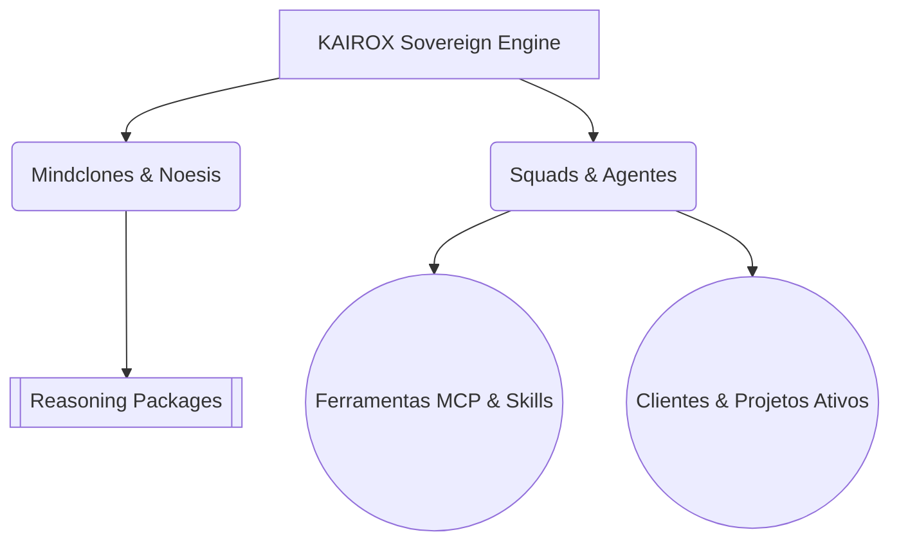

# 000 - KAIROS Root (Map of Content)

Bem-vindo ao centro nervoso do **KAIROS OS v3.1** (Baseado no AIOX v5.0.0).
Este nó interliga tudo o que existe no seu ecossistema Sovereign. Use esta visão 360º para navegar rapidamente para onde importa.

## Arquitetura Geral

## Índice de Navegação (Links)

- 🧠 [[001 - Core Features & Engines]] — O coração do boot (Task-First, Hivemind, God Pool e Skortex).
- 🧬 [[005 - Mindclones & Estado Cognitivo]] — Sua identidade ancorada (`Noesis`), clones de produtividade e baseline de qualidade.
- 👥 [[002 - Squads & Agents]] — Seu exército particular. Visão dos 21 squads locais e da comunidade.
- 🛠️ [[003 - Tools & Integrações]] — O arsenal agêntico. Ferramentas MCP JavaScript e Python, APIs (Evolution, N8N, Composio).
- 📜 [[004 - Reasoning Packages (RPs)]] — Os modelos mentais consolidados. Como os agentes raciocinam baseados em seus frameworks (Strategic, Core e Tasks).
- 💸 [[006 - Clientes e Projetos Ativos]] — Foco no _Money Rush_. A fila de negócios reais e quem de seus agentes é o owner de cada bucha.

> [!TIP] Dica de Navegação
> Se você está se sentindo perdido ou travado no dia a dia, comece pelo [[006 - Clientes e Projetos Ativos]] para entender onde alocar sua atenção e então ative os [[002 - Squads & Agents]] adequados usando as ferramentas MCP apropriadas.
