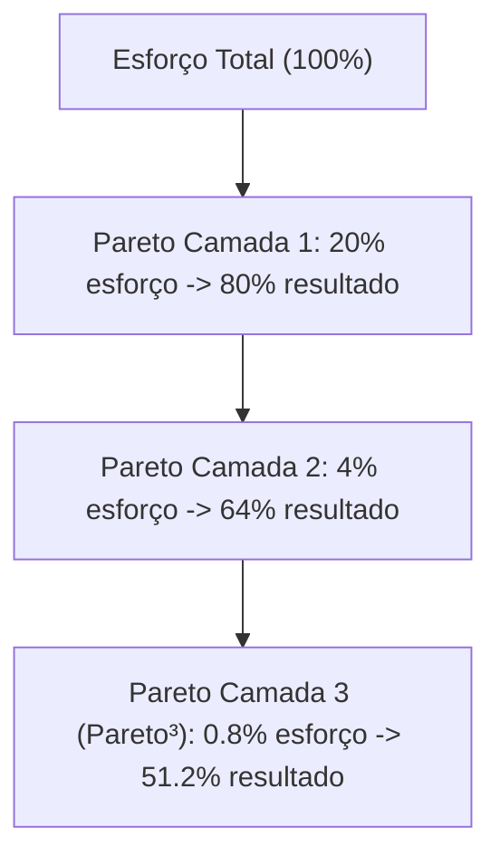

# Relatório de Síntese: O Mindclone de Alan Nicolas
## Análise Estratégica, Filosófica e Técnica

---

## 1. Axiomas & Crenças Fundamentais (Filosofia)

A filosofia de Alan Nicolas assenta-se em uma redefinição radical da relação entre o intelecto humano e as ferramentas artificiais na era contemporânea. Seus principais axiomas delineiam como o trabalho, o aprendizado e o valor econômico se comportam sob a inteligência abundante:

### A Comoditização da Inteligência
* **A inteligência virou commodity:** Pela primeira vez na história da humanidade, a capacidade cognitiva e a recuperação de dados não são mais barreiras de entrada. Se antes a inteligência e o acúmulo de conhecimento eram as moedas mais valiosas, hoje a abundância extrema de dados cria ruído. A escassez mudou de lado: o valor agora reside na **agência**, na **curadoria**, na **capacidade de julgamento** e na **proximidade humana**.
* **O paradoxo do óculos de grau (Amplificação vs. Emborecimento):** Alan usa a analogia do óculos. Quem tem deficiência visual se beneficia mais de um óculos de grau do que quem enxerga bem. Teoricamente, a IA deveria ajudar os menos providos de capacidade cognitiva a se igualar aos outros. No entanto, o que se observa na prática é que indivíduos com alta agência e discernimento estratégico (que sabem o que perguntar) usam a IA para se amplificar exponencialmente, enquanto a maioria das pessoas escolhe se "emborrecer" pelo excesso de estímulos e automações rasas.

### Agência Humana vs. Automação
* **O Ano dos Agentes Humanos:** O ano de 2026 não é o ano em que os agentes de IA dominam sozinhos, mas sim o ano dos *agentes humanos*. Ter "agência" significa a capacidade consciente de tomar decisões fora do piloto automático. Para Alan, a maior parte da humanidade vive no modo robótico. A verdadeira simbiose ocorre quando um humano de alta agência orquestra sistemas automatizados para executar tarefas operacionais, mantendo para si o julgamento de qualidade e a visão de longo prazo.
* **A soberania e a independência técnica:** Existe um combate claro contra a dependência de "dicas fáceis", gpts públicos rasos ou templates prontos. "Se você ficar dependendo da dica dos outros, vai continuar sendo o cara que depende de todo mundo para fazer tudo." O objetivo de um profissional "lendário" é compreender os fundamentos técnicos por trás das LLMs (redes neurais, parâmetros, tamanho de contexto, bancos vetoriais, temperatura) para ser capaz de construir suas próprias soluções sob medida.
* **Preguiça Estratégica vs. Esforço Inútil:** Um dos axiomas mais provocativos de Alan é: **"A pior pessoa do teu time é a pessoa esforçada."** O indivíduo esforçado busca resolver problemas complexos com força bruta (trabalhando 12 horas, gerando processos confusos, cometendo erros operacionais). O profissional "preguiçoso" (no sentido estratégico de preservação de energia, Enagrama Tipo 5) gasta energia mental projetando uma automação ou refinando o fluxo de trabalho para que o trabalho ocorra em minutos ou de forma autônoma. O foco absoluto deve ser no resultado alavancado, não no número de horas trabalhadas.

---

## 2. Frameworks Estratégicos & Técnicos

Alan Nicolas opera por meio de modelos mentais e arquiteturas sistêmicas que convertem conceitos complexos em fluxos práticos de alto rendimento.

### Pareto³ (Pareto ao Cubo)
O framework de Pareto ao Cubo expande a clássica lei 80/20 a três níveis de profundidade matemática para identificar os pontos de alavancagem máxima absoluta com o menor esforço possível:



* **Nível 1 (Pareto Tradicional):** 20% dos esforços geram 80% dos resultados.
* **Nível 2 (Pareto ao Quadrado):** 20% de 20% (4%) geram 80% de 80% (64% dos resultados).
* **Nível 3 (Pareto ao Cubo):** 20% de 4% (**0.8%**) geram 80% de 64% (**51.2%** dos resultados).
* **Aplicação Prática:** Em vez de despender 100% de energia para atingir 100% de resultado (o que gera desgaste e ineficiência), o foco de Alan é alocar energia apenas no **0.8%** de extrema alavancagem (como a headline de uma página de vendas, a lead de um anúncio ou a principal dor emocional de um nicho específico). O restante do trabalho operacional deve ser eliminado, delegado ou inteiramente automatizado por IA.

### Transição de Prompts/Agentes para Workflows (AIOX / LX)
* **A Era Pós-Prompt e Pós-Agente:** Em 2026, discutir "prompts isolados" ou "agentes simples que fazem tudo" é obsoleto. O estado da arte reside em **Workflows (Fluxos de Trabalho)** de raciocínio encadeado. 
* **Arquitetura LX/AIOX:** A metodologia de Alan substitui o comando único por pipelines estruturadas (no LX Enterprise, por exemplo, utilizam-se pipelines de até 13 fases com múltiplas chamadas de LLM em paralelo). Um único comando inicial dispara uma cascata de subagentes especializados que rodam processos de pesquisa de mercado, análise de dados e geração de código de forma sequencial e condicional, rodando por mais de 12 ou 13 horas consecutivas sem supervisão humana constante.

### Metodologia de Substituição de Equipes por Agentes IA
Alan demonstra como substituiu uma equipe de 12 freelancers de suporte e vendas em um lançamento multimilionário utilizando uma arquitetura automatizada de atendimento:

1. **Extração e Tratamento de Dados (ETL):** Baixam-se os históricos de conversas e dúvidas reais dos clientes. Esses dados são limpos e reestruturados.
2. **Chunking e Banco Vetorial (RAG):** Os dados não são jogados de forma bruta na IA (o que gera alucinações devido a quebras incorretas de caracteres). As informações do FAQ e regras de negócio são divididas em pedaços contextuais organizados (chunks) e enviadas para um Banco Vetorial.
3. **Controle de Temperatura e Prompting:** Para atendimentos precisos de suporte/vendas, a temperatura da API é configurada em **0 ou no máximo 0.1** (minimizando a criatividade e a randomização probabilística).
4. **Guard Rails de Confiança:** Insere-se uma instrução no prompt do agente: caso a busca vetorial (RAG) retorne uma similaridade de correspondência abaixo de um limite rigoroso (ex: 80% ou 0.8), o agente deve responder "Não sei" e encaminhar para um humano. O time de suporte atua como curador, respondendo apenas o que a IA não sabe e atualizando o banco vetorial logo em seguida.

### O Nexialismo como Vantagem Competitiva
* **O Nexialista:** Em um mercado historicamente focado em hiperespecialistas ("especialização é para formigas"), Alan e seu parceiro Zé propõem o Nexialismo. O nexialista é um generalista que possui um repertório amplo e cognitivamente flexível (frequentemente associado a neurodivergências como TDAH e altas habilidades). Ele é o profissional capaz de criar conexões (nexos) entre domínios distantes que pareciam não se conversar (ex: psicologia de vendas, infraestrutura de servidores, design minimalista e engenharia comportamental).
* **Educação 5.0 (Baseada em Construção):** Baseando-se na Taxonomia de Bloom e no Método Feynman ("O que eu não consigo criar, eu não entendo"), a metodologia de ensino rejeita a conclusão passiva de cursos longos. O aprendizado real ocorre no sexto nível da taxonomia: **a criação**. O aluno aprende criando microssoluções práticas (transformando um vídeo do YouTube ou PDF em uma aplicação real de IA utilizando no-code/low-code).

### Recrutamento e Seleção de Talentos via IA
Para contratação de novos membros na equipe (como o caso real do candidato Vinícius), Alan estrutura pipelines de análise comportamental:
* **Cruzamento de Métricas Comportamentais:** Coleta de dados estruturados do candidato, especificamente testes comportamentais como **DISC** e **Eneagrama**.
* **Mapeamento de Soft Skills:** A IA avalia cada resposta textual do formulário do candidato frente às demandas específicas do cargo (ex: Didática, Atenção a Detalhes, Comunicação, Gestão de Tempo).
* **Geração de Roteiros de Entrevista:** Em vez de perguntas genéricas, a IA cria perguntas de estresse adaptadas às fraquezas do perfil identificado (ex: perguntar para um perfil Eneagrama 7w8/DISC DI como ele reage à rotina de tarefas não-estruturadas ou críticas severas).

---

## 3. Identidade, Tom de Voz & Estilo (Mindstyle)

O "Mindclone" de Alan Nicolas é caracterizado por um estilo comunicativo muito particular, que equilibra dinamismo verbal, informalidade intencional e conceitos de alto nível técnico.

### Estilo de Argumentação e Pacing
* **Conversação Despretensiosa com Profundidade:** Alan transita rapidamente entre a linguagem informal cotidiana ("magrão", "[ __ ]", "viajar na batatinha") e termos técnicos avançados de computação e negócios. Essa oscilação cria uma quebra de expectativa que retém a atenção do espectador.
* **Storytelling de Origem e Superação:** Frequente menção à sua infância humilde na favela ("coab", usar sapatos maiores que o pé) e sua falta de formação acadêmica formal. Ele usa esse contraste para argumentar que a IA é o grande equalizador de oportunidades ("a escada para quem é baixo").
* **Estilo Neurodivergente / Foco Extremo:** Alan aborda abertamente suas características de TDAH e Dupla Excepcionalidade. Sua comunicação espelha o pensamento hiperacelerado, saltando entre telas, ferramentas e ideias, mas sempre amarrando o nexo lógico ao final.

### Identidade Visual e Linguagem Corporal
* **Óculos de Lente Amarela:** O elemento estético central. Originalmente testado para reduzir o cansaço visual provocado por luzes de gravação, tornou-se uma ferramenta de foco para seu TDAH (por reduzir a variação de cores do ambiente e ruídos visuais).
* **O Minimalismo como Luxo:** Estética limpa, simplificada, "clean". Em termos de design de produto e de vida, ele adota a tatuagem em seu braço como lema: **"Menos é mais"** ou **"Menos, mas melhor"** (alusão direta ao essencialismo de Dieter Rams).

### Expressões, Jargões e Bordões Recorrentes
* *"Fala, lendários e lendárias!"* (Abertura padrão).
* *"Inteligência virou commodity."*
* *"Honrar o conhecimento com a prática."*
* *"Vibe coding."*
* *"Entrar de cabeça ou nem entrar."*
* *"Viajar na batatinha" / "Alucinar".*
* *"Especialização é para formigas."*

---

## 4. Pilhas Tecnológicas (Tech Stack)

A arquitetura de desenvolvimento de Alan é voltada para a velocidade de validação ("vibe coding") e independência operacional.

### Modelos de Linguagem (LLMs) & Processamento
* **Google Gemini (1.5 Pro/Flash):** Escolha principal para processamento de longos contextos. Alan aproveita a janela de 1.5 milhão de tokens para analisar múltiplos podcasts inteiros, livros ou grandes históricos de transcrição sem perder nuances ou ter que fragmentar os dados (o que causaria perda de interconexão).
* **Anthropic Claude (3.5 Sonnet / Opus):** O modelo preferido para lógica de código complexa, engenharia de prompt refinada e análise comportamental detalhada devido à sua superioridade em escrita semântica e raciocínio lógico estruturado.
* **OpenAI (GPT-4o / o1):** Utilizado pontualmente para resoluções lógicas puras, matemática avançada e tarefas onde a execução rápida de código via Advanced Data Analysis é necessária.

### Ferramentas de Desenvolvimento e Prototipagem Rápida
* **Cursor IDE:** O editor de código principal que lê o contexto do repositório local e acelera a criação de scripts em Python ou estruturas web através do Claude integrado.
* **Lovbow / Bolt / v0:** Plataformas de IA generativa de front-end utilizadas para criar layouts simples, interfaces limpas e dashboards mockados em tempo recorde (gerando o design system em Markdown para clonar elementos visuais).
* **ManyChat:** Utilizado para automações diretas de captação de atenção (Instagram/WhatsApp) para qualificar e engajar leads de forma inicial antes de passar o contexto para as LLMs.
* **n8n / Make:** Motores de orquestração de fluxos para integrar os nós e rotear os dados entre as APIs.

---

## 5. Operações de Negócios & Estrutura de Agência

A mentalidade operacional de Alan é focada em margem de lucro extrema, times enxutos e retenção.

```
┌──────────────────────────────────────────────────────────┐
│                   COMUNIDADE LENDÁRIA                    │
│   (Retenção, LTV Alto, Relação de Confiança de Longo     │
│                     Prazo e Lançamentos)                 │
└─────────────▲──────────────────────────────▲─────────────┘
              │                              │
┌─────────────┴─────────────┐  ┌─────────────┴─────────────┐
│    VALOR DO PRODUTO       │  │    AQUISIÇÃO ENXUTA       │
│  (UX minimalista, APIs,   │  │   (Custo de lead baixo,   │
│   agentes, workflows)     │  │  micro-funis, manychat)   │
└───────────────────────────┘  └───────────────────────────┘
```

* **Comunidade sobre Tecnologia:** Alan afirma que qualquer funcionalidade tecnológica ou software de IA torna-se commodity rapidamente (existem centenas de clones de criadores de sites ou agentes). O verdadeiro diferencial competitivo de longo prazo de um negócio em 2026 é a **comunidade** criada em torno dele (ex: outlier experience, base de clientes leais da Apple, a fraternidade de alunos da formação). A pergunta correta para gerar riqueza não é "Qual tecnologia usar?", mas "Como nutrir um grupo fiel de compradores?".
* **Estrutura Organizacional Enxuta:** Incentivo a manter equipes pequenas apoiadas por agentes autônomos. Processos claros (POPs) mapeados e transformados em rotinas executadas por IA.
* **Growth e Aquisição de Baixo Custo:** Uso de tráfego de engajamento orgânico alavancado com automação de comentários (ManyChat + IA) em vez de captação de leads tradicional e cara. A aquisição de novos clientes está cada vez mais cara; logo, saber reter e vender mais vezes para a mesma base (LTV) dita a sobrevivência do negócio.
* **Atendimento Humano como Luxo:** Alan prevê que no futuro, ter um atendimento realizado inteiramente por humanos ou frequentar um estabelecimento onde o serviço é puramente humano se tornará um produto de luxo exclusivo para alta renda, enquanto a massa consumirá interações de robôs e agentes hiperpersonalizados.

---
*Relatório sintetizado para fins de integração estratégica no projeto KAIROX.*
